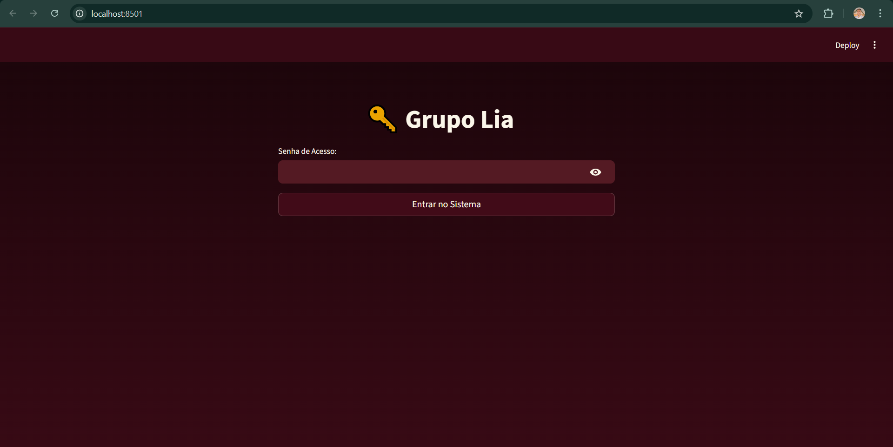
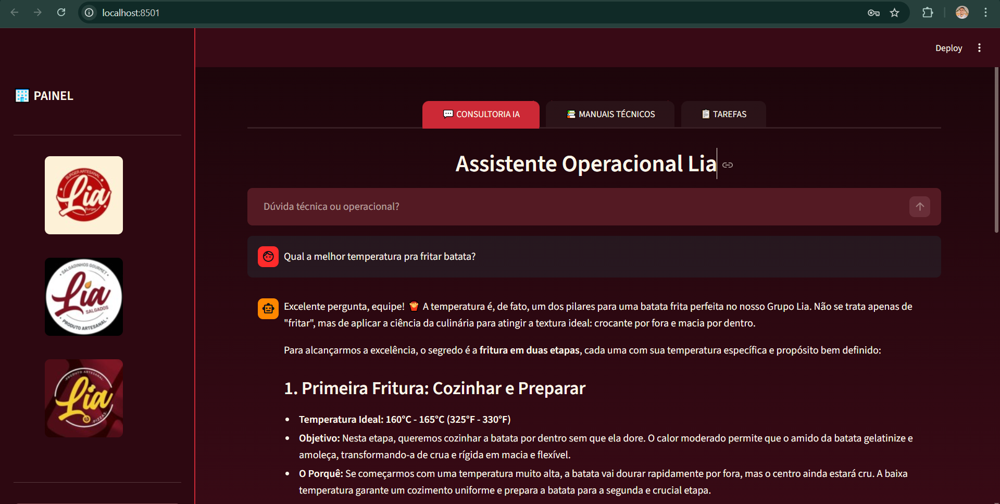
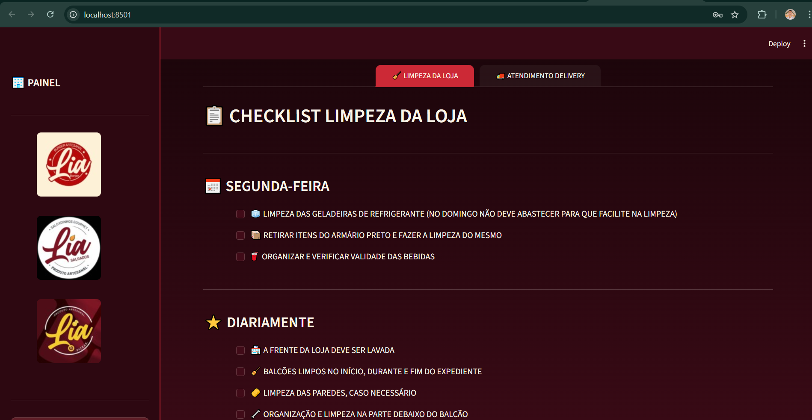
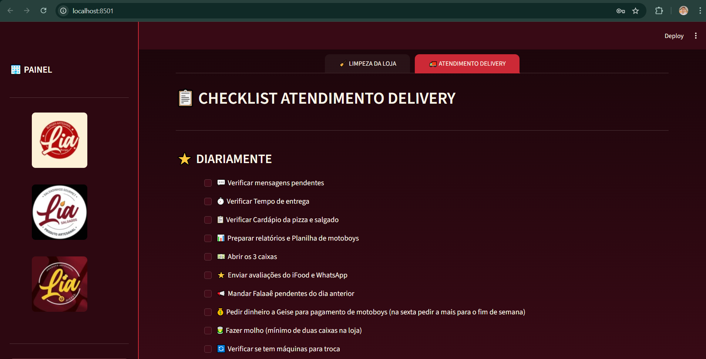

# 🍔🍕 Copiloto e Dashboard Operacional - Grupo Lia

[](https://www.python.org/)
[](https://streamlit.io/)
[](https://ai.google.dev/)

Este é um projeto profissional de consultoria tecnológica desenvolvido sob medida para o **Grupo Lia**. O Grupo Lia opera três verticais de negócio distintas no setor de alimentação e delivery:

1.  🔥 **Lia Burguer** (Hambúrgueres artesanais)
2.  🥟 **Lia Salgados** (Salgados gourmet e tradicionais)
3.  🍕 **Lia Pizzas** (Pizzas artesanais)

O objetivo desta aplicação é centralizar a gestão operacional, padronizar procedimentos técnicos e fornecer suporte instantâneo à equipe através de Inteligência Artificial avançada.

## 🚀 Funcionalidades Principais

A aplicação é dividida em módulos estratégicos, acessíveis através de uma interface intuitiva com navegação por abas.

### 🔐 1. Autenticação e Segurança
Para garantir a integridade da operação, o sistema possui uma tela de login restrita. O acesso é liberado apenas para funcionários autorizados via senha de turno, protegendo as informações estratégicas do grupo.

<p align="center">
  
</p>

### 🤖 2. Consultoria IA (Assistente Lia)
Este é o coração da inteligência do sistema. Através de um chat interativo conectado à API do Google Gemini, o funcionário tem acesso a um "Especialista Operacional" 24/7. A IA foi instruída para atuar como Chef Executivo do Grupo Lia, respondendo dúvidas técnicas, sugerindo tempos de preparo e garantindo a padronização.

<p align="center">
  
</p>
<p align="center"><em>Exemplo: IA respondendo com detalhes técnicos sobre a temperatura ideal para fritura.</em></p>

### 📚 3. Manuais Técnicos e Procedimentos
Esta aba centraliza a base de conhecimento estática do grupo. Através de menus de seleção, o funcionário escolhe a unidade (Burguer, Pizza ou Salgados) e tem acesso imediato a procedimentos fixos, como temperatura de chapa, tempos de preparo e dicas de ouro para evitar desperdício.

<p align="center">
  
</p>
<p align="center"><em>Visualização de Procedimentos de Chapa para Lia Burguer.</em></p>

### 📋 4. Mural de Tarefas e Checklists Dinâmicos
Módulo focado na execução perfeita das rotinas. O sistema oferece abas internas que dividem os checklists por tipo (Limpeza ou Delivery) e por temporalidade (Segunda-feira, Sexta-feira e Diariamente), garantindo que nenhuma etapa crítica seja esquecida no início, durante ou fim do expediente.

<p align="center">
  
</p>
<p align="center"><em>Checklist detalhado de Limpeza para Segundas e Diariamente.</em></p>

<p align="center">
  
</p>
<p align="center"><em>Checklist operacional para rotinas de Delivery e Fechamento.</em></p>

## 🛠️ Tecnologias Utilizadas

Este projeto foi construído utilizando as tecnologias mais modernas do ecossistema Python para aplicações de dados e IA:

* **[Python](https://www.python.org/)**: Linguagem base do projeto.
* **[Streamlit](https://streamlit.io/)**: Framework utilizado para o desenvolvimento da interface web (frontend e backend em Python), com foco em UX/UI responsivo e dark mode nativo.
* **[Google Gemini AI API](https://ai.google.dev/)**: Modelo de linguagem grande (LLM) utilizado para a inteligência do Consultor Operacional.
* **[python-dotenv](https://pypi.org/project/python-dotenv/)**: Gerenciamento seguro de variáveis de ambiente (Chaves de API e Senhas).

## 🧑‍💻 Instalação e Execução Local

Se você deseja rodar este projeto na sua máquina para testes:

1.  **Clone o repositório:**
    ```bash
    git clone [https://github.com/seu-usuario/dashboard-grupo-lia.git](https://github.com/seu-usuario/dashboard-grupo-lia.git)
    cd dashboard-grupo-lia
    ```

2.  **Crie e ative um ambiente virtual (recomendado):**
    ```bash
    python -m venv .venv
    # No Windows:
    .\.venv\Scripts\activate
    # No Mac/Linux:
    source .venv/bin/activate
    ```

3.  **Instale as dependências:**
    ```bash
    pip install -r requirements.txt
    ```

4.  **Configure as variáveis de ambiente:**
    Crie um arquivo `.env` na raiz do projeto e adicione suas chaves (use o arquivo `.env.example` como modelo, se disponível):
    ```env
    CHAVE_API="SUA_CHAVE_API_DO_GOOGLE_GEMINI_AQUI"
    SENHA_ACESSO="SUA_SENHA_DE_ACESSO_OPERACIONAL_AQUI"
    ```

5.  **Execute a aplicação:**
    ```bash
    streamlit run meu_assistente.py
    ```

---
Este projeto é um exemplo de como a tecnologia e a IA podem ser aplicadas para otimizar operações reais no varejo de alimentação, garantindo padronização, reduzindo erros e acelerando o treinamento de equipe.
